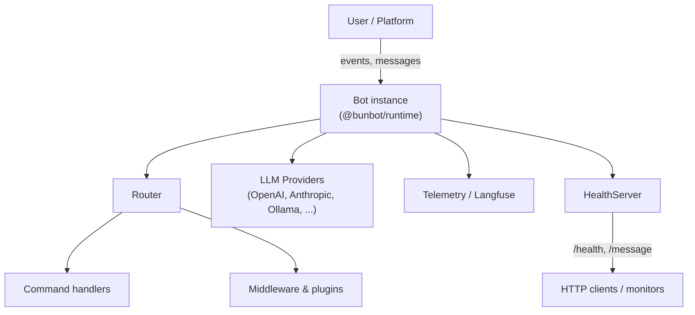

## @bunbot/runtime

Lightweight bot runtime built on **Bun** for fast, simple deployments.

### Install

```bash
npm install @bunbot/runtime
# or
bun add @bunbot/runtime
```

### Quick start

```ts
import { createBot } from "@bunbot/runtime";

const bot = createBot({
  name: "bunbot",
  commands: [
    {
      name: "ping",
      description: "Ping the bot",
      handler: async (ctx) => {
        await ctx.reply("pong");
      },
    },
  ],
});

await bot.start();
```

### Architecture



### Health server

`@bunbot/runtime` includes a tiny health server for uptime checks and simple command execution over HTTP.

```ts
import { HealthServer } from "@bunbot/runtime/server";

const server = new HealthServer({
  port: 3000,
  healthPath: "/health",
});

server.start(async ({ command, args }) => {
  if (command === "ping") return "pong";
  return null;
});
```

### Publishing (maintainers)

To publish a new version:

```bash
bun install
bun run build
npm publish
```

